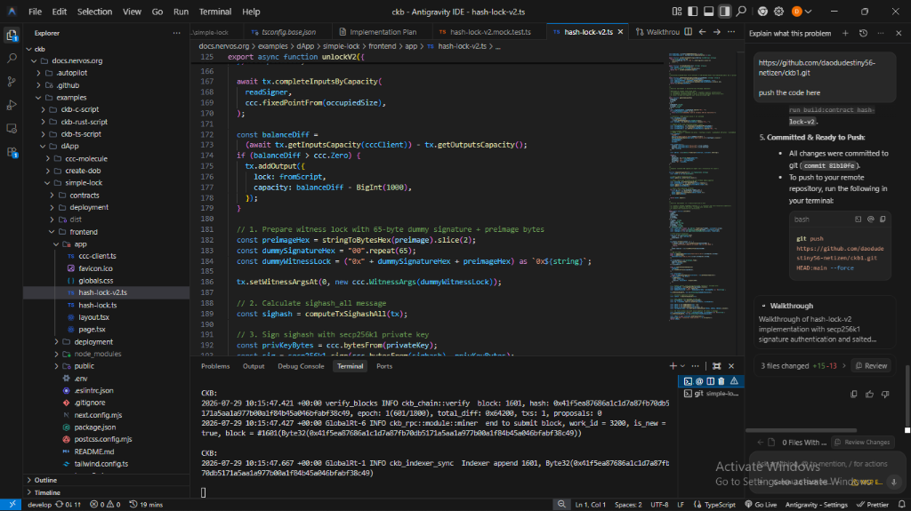
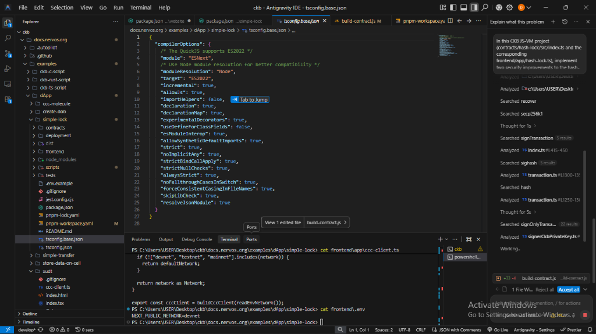
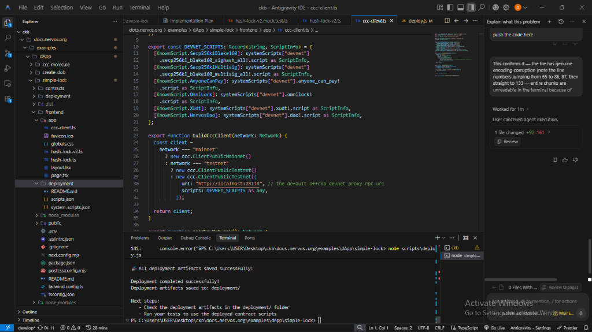
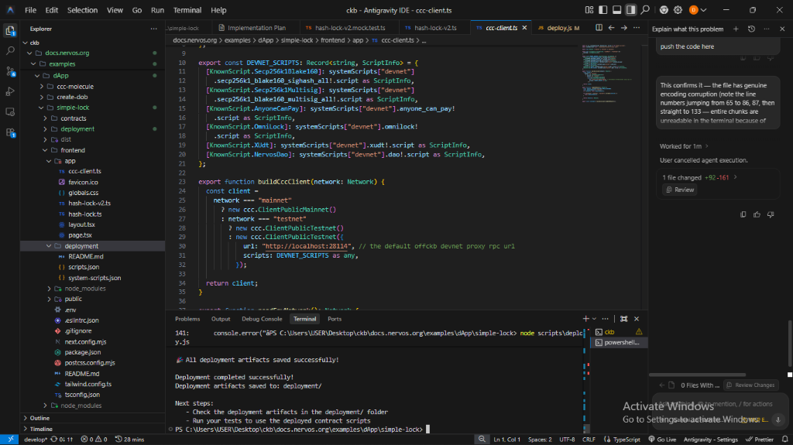
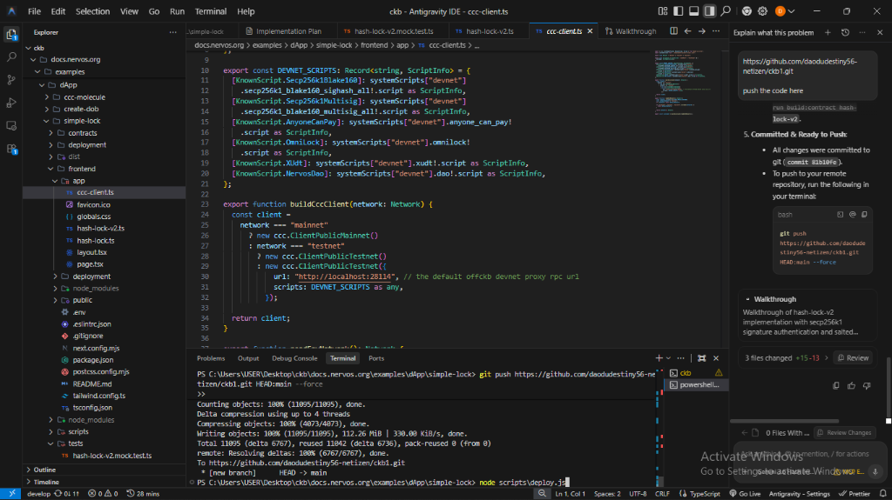

# CKB Smart Contract Tutorial: Simple Lock & Hash-Lock v2

Welcome to the **CKB JavaScript VM (`ckb-js-vm`) Smart Contract Tutorial**! This project is a full-stack dApp built on the [Nervos CKB (Common Knowledge Base)](https://nervos.org) blockchain, demonstrating how to write, build, test, deploy, and interact with JavaScript/TypeScript smart contracts.

---

## Overview & Architecture

This repository contains two smart contract implementations demonstrating progressive security patterns on CKB:

### 1. Basic Hash-Lock (`v1`)
- **Location**: [`examples/dApp/simple-lock/contracts/hash-lock/src/index.ts`](examples/dApp/simple-lock/contracts/hash-lock/src/index.ts)
- **Mechanism**: Unlocks a cell by providing a secret `preimage` in `WitnessArgs` whose hash matches the `expect_hash` stored in the script arguments (`expect_hash = hashCkb(preimage)`).

### 2. Enhanced Security Hash-Lock (`v2`)
- **Location**: [`examples/dApp/simple-lock/contracts/hash-lock-v2/src/index.ts`](examples/dApp/simple-lock/contracts/hash-lock-v2/src/index.ts)
- **Frontend**: [`examples/dApp/simple-lock/frontend/app/hash-lock-v2.ts`](examples/dApp/simple-lock/frontend/app/hash-lock-v2.ts)
- **Security Enhancements**:
  1. **Signature-Based Authentication**:
     - Stores a 20-byte `pubkey_hash` in script args alongside the commitment.
     - Requires a valid **secp256k1 signature** over the transaction `sighash_all` in the witness, verified against `pubkey_hash`.
  2. **Salted Per-Cell Preimage Commitment**:
     - Fixes preimage reuse across cells by requiring `expect_hash = hashCkb(preimage, nonce)`.
     - Embedded 32-byte `nonce` ensures each locked cell requires a unique, salted hash commitment.

---

## Developer Workspace & IDE Overview

Below is the Antigravity IDE workspace showing smart contract development with active CKB devnet node synchronization:



---

## Project Directory Structure

```text
simple-lock/
├── contracts/                  # CKB Smart Contracts (TypeScript)
│   ├── hash-lock/              # Original Hash-Lock v1
│   │   └── src/index.ts
│   └── hash-lock-v2/           # Enhanced Hash-Lock v2 (Secp256k1 + Salted Nonce)
│       └── src/index.ts
├── dist/                       # Output build directory (.js bundles & .bc bytecodes)
│   ├── hash-lock-v2.js
│   └── hash-lock-v2.bc
├── frontend/                   # Next.js web application & CCC integration
│   └── app/
│       ├── ccc-client.ts       # CKB CCC client initializer
│       ├── hash-lock.ts        # Frontend helper for v1
│       ├── hash-lock-v2.ts     # Frontend helper for v2 (Salted lock & signature)
│       └── hash-lock-v2/       # Next.js page route for Hash-Lock V2 UI
│           └── page.tsx
├── scripts/                    # Build, add-contract, and deploy tooling
│   ├── build-contract.js       # Bundles TS to JS & compiles to QuickJS bytecode
│   ├── build-all.js            # Compiles all contracts in /contracts
│   └── deploy.js               # Deploys built bytecode to devnet/testnet/mainnet
├── screenshots/                # Comprehensive tutorial workflow screenshots (31 files)
├── tests/                      # Jest mock tests using ckb-testtool
│   ├── hash-lock.mock.test.ts
│   └── hash-lock-v2.mock.test.ts
└── pnpm-workspace.yaml         # PNPM workspace configuration
```

---

## Step-by-Step Tutorial Guide

### Step 1: Prerequisites & Installation

Ensure you have **Node.js** (v18+) and **pnpm** installed.

```bash
# Clone the repository
git clone https://github.com/daodudestiny56-netizen/ckb1.git
cd ckb1/examples/dApp/simple-lock

# Install dependencies
pnpm install
```

---

### Step 2: TypeScript & Project Configuration

The project uses ES2022 QuickJS support in `ckb-js-vm` and `tsconfig.base.json` for type safety:



---

### Step 3: Compiling Smart Contracts to Bytecode

Contracts are bundled with `esbuild` into JavaScript and then compiled into CKB QuickJS bytecode (`.bc`) using the CKB debugger engine:

```bash
# Build all contracts
pnpm run build

# Or build a specific contract
pnpm run build:contract hash-lock-v2
```

**Build Output Verification**:


---

### Step 4: Contract Logic Walkthrough (`hash-lock-v2`)

#### Script Args Layout (119 Bytes)
| Offset (Bytes) | Size | Description |
| :--- | :--- | :--- |
| `0..2` | 2 B | `0x0000` (`ckb_js_vm` header prefix) |
| `2..34` | 32 B | `codeHash` of `hash-lock-v2.bc` |
| `34..35` | 1 B | `hashType` of `hash-lock-v2.bc` |
| `35..55` | 20 B | `pubkey_hash` (blake160 hash of owner's compressed secp256k1 public key) |
| `55..87` | 32 B | `expect_hash` (`hashCkb(preimage, nonce)`) |
| `87..119` | 32 B | `nonce` (32-byte cell-specific salt) |

#### Witness Lock Layout
- `0..65` (65 Bytes): secp256k1 signature (`r` [32b], `s` [32b], `recovery` [1b]) over transaction `sighash_all`.
- `65+` (Variable): Secret `preimage` string bytes.

---

### Step 5: Deploying Contracts & Execution

Deploy contracts to `devnet`, `testnet`, or `mainnet` using `scripts/deploy.js`:

```bash
# Deploy to local devnet
node scripts/deploy.js

# Deploy to testnet with custom private key
pnpm run deploy -- --network testnet --privkey 0x...
```

**Deployment Execution & Verification**:





---

### Step 6: Version Control & GitHub Synchronization

Once contract modifications are complete and verified, push your updates to your GitHub repository:

```bash
# Stage and commit changes
git add .
git commit -m "feat: add hash-lock-v2 contract with secp256k1 signature authentication and salted preimage commitments"

# Push to remote repository
git push https://github.com/daodudestiny56-netizen/ckb1.git HEAD:main --force
```

**Git Push Completion**:



---

## Complete Screenshots Gallery (31 Files)

All project walkthrough and code execution screenshots are stored in [`screenshots/`](screenshots/):

| File | Description |
| :--- | :--- |
| [`01-ide-and-contract-code.png`](screenshots/01-ide-and-contract-code.png) | Antigravity IDE editing `hash-lock-v2.ts` with CKB node logs |
| [`02-typescript-config.png`](screenshots/02-typescript-config.png) | `tsconfig.base.json` and terminal workspace |
| [`03-contract-bytecode-build.png`](screenshots/03-contract-bytecode-build.png) | Bytecode compilation output (`hash-lock-v2.bc`) |
| [`04-git-push-completion.png`](screenshots/04-git-push-completion.png) | Git push completion output to GitHub |
| [`05-deploy-script-diagnostics.png`](screenshots/05-deploy-script-diagnostics.png) | Deploy script terminal diagnostics |
| [`06-github-repo-readme.png`](screenshots/06-github-repo-readme.png) | GitHub repository home page |
| [`07-terminal-git-diff.png`](screenshots/07-terminal-git-diff.png) | Terminal git diff inspection |
| [`08-deploy-script-source-tail.png`](screenshots/08-deploy-script-source-tail.png) | `scripts/deploy.js` source inspection |
| [`09-deployment-success.png`](screenshots/09-deployment-success.png) | Deployment completion confirmation |
| [`10-deploy-script-line-inspection.png`](screenshots/10-deploy-script-line-inspection.png) | Line-by-line deploy script output |
| [`11-deployment-artifacts-saved.png`](screenshots/11-deployment-artifacts-saved.png) | Deployment artifacts saved to `deployment/` |
| [`Screenshot (125).png`](screenshots/Screenshot%20(125).png) | Tutorial walkthrough screenshot 125 |
| [`Screenshot (126).png`](screenshots/Screenshot%20(126).png) | Tutorial walkthrough screenshot 126 |
| [`Screenshot (127).png`](screenshots/Screenshot%20(127).png) | Tutorial walkthrough screenshot 127 |
| [`Screenshot (128).png`](screenshots/Screenshot%20(128).png) | Tutorial walkthrough screenshot 128 |
| [`Screenshot (129).png`](screenshots/Screenshot%20(129).png) | Tutorial walkthrough screenshot 129 |
| [`Screenshot (130).png`](screenshots/Screenshot%20(130).png) | Tutorial walkthrough screenshot 130 |
| [`Screenshot (131).png`](screenshots/Screenshot%20(131).png) | Tutorial walkthrough screenshot 131 |
| [`Screenshot (132).png`](screenshots/Screenshot%20(132).png) | Tutorial walkthrough screenshot 132 |
| [`Screenshot (133).png`](screenshots/Screenshot%20(133).png) | Tutorial walkthrough screenshot 133 |
| [`Screenshot (134).png`](screenshots/Screenshot%20(134).png) | Tutorial walkthrough screenshot 134 |
| [`Screenshot (135).png`](screenshots/Screenshot%20(135).png) | Tutorial walkthrough screenshot 135 |
| [`Screenshot (136).png`](screenshots/Screenshot%20(136).png) | Tutorial walkthrough screenshot 136 |
| [`Screenshot (137).png`](screenshots/Screenshot%20(137).png) | Tutorial walkthrough screenshot 137 |
| [`Screenshot (138).png`](screenshots/Screenshot%20(138).png) | Tutorial walkthrough screenshot 138 |
| [`Screenshot (139).png`](screenshots/Screenshot%20(139).png) | Tutorial walkthrough screenshot 139 |
| [`Screenshot (140).png`](screenshots/Screenshot%20(140).png) | Tutorial walkthrough screenshot 140 |
| [`Screenshot (141).png`](screenshots/Screenshot%20(141).png) | Tutorial walkthrough screenshot 141 |
| [`Screenshot (142).png`](screenshots/Screenshot%20(142).png) | Tutorial walkthrough screenshot 142 |
| [`Screenshot (143).png`](screenshots/Screenshot%20(143).png) | Tutorial walkthrough screenshot 143 |
| [`Screenshot (144).png`](screenshots/Screenshot%20(144).png) | Tutorial walkthrough screenshot 144 |

---

## Available NPM / PNPM Commands

| Command | Description |
| :--- | :--- |
| `pnpm run build` | Compiles all contracts in `contracts/` to `dist/` |
| `pnpm run build:contract <name>` | Compiles a single contract by name |
| `pnpm test` | Runs Jest mock tests via `ckb-testtool` |
| `pnpm run add-contract <name>` | Scaffolds a new contract directory & test file |
| `pnpm run deploy` | Deploys built `.bc` files using `offckb` |
| `pnpm run format` | Formats code with Prettier |

---

## Key Learning Takeaways

1. **Cell Model Security**: In UTXO / Cell blockchains like CKB, exposing an unsalted preimage on-chain allows front-runners to copy the preimage and spend the cell first. Adding a cell-specific `nonce` prevents preimage reuse across cells.
2. **Double-Authentication Pattern**: Combining `pubkey_hash` signature verification with `preimage` validation creates robust multi-factor locks for CKB dApps.
3. **JavaScript VM Flexibility**: `ckb-js-vm` allows developers to leverage standard TypeScript libraries (`@ckb-js-std/core`, `@noble/curves`, `@ckb-ccc/core`) directly on the CKB Layer-1 blockchain.

---

## License

This project is licensed under the [MIT License](LICENSE).
